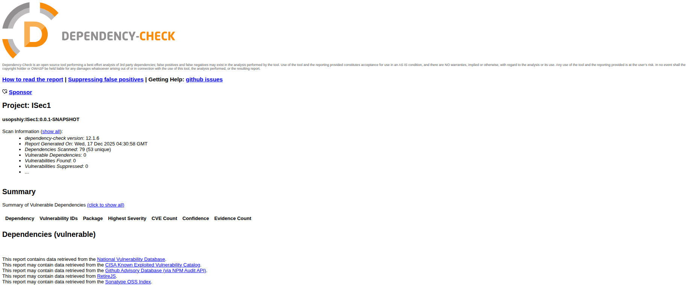
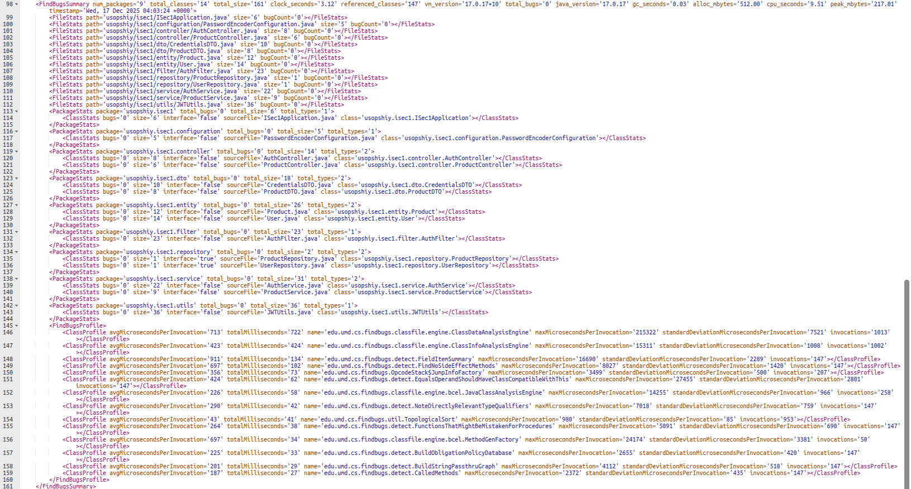

# Информационная безопасность

## Лабораторная работа №1

### Стек

- Java/Spring
- Hibernate
- PostgreSQL

### Описание API

`POST /auth/register`: метод для регистрации пользователя (принимает логин и пароль).

```json
{
    "login": "username",
    "password": "12345678"
}
```

`POST /auth/login`: метод для аутентификации пользователя (принимает логин и пароль).

```json
{
    "login": "username",
    "password": "12345678"
}
```

`GET /api/data`: метод для получения данных. Доступ только у аутентифицированных пользователей.

### Описание реализованных мер защиты

- От **SQLi** код защищен с помощью ORM Hibernate.
- От **XSS** защищен с помощью экранирования пользовательских данных

```java
User userModel = new User(
  HtmlUtils.htmlEscape(credentialsDto.login()),
  passwordEncoder.encode(credentialsDto.password())
);
```

```java
public List<Product> getAllProducts() {
  return productRepository.findAll().stream().peek(
    it -> it.setName(HtmlUtils.htmlEscape(it.getName()))
  ).toList();
}
```

### Отчеты из pipeline

Dependency-check:



Spotbugs:

